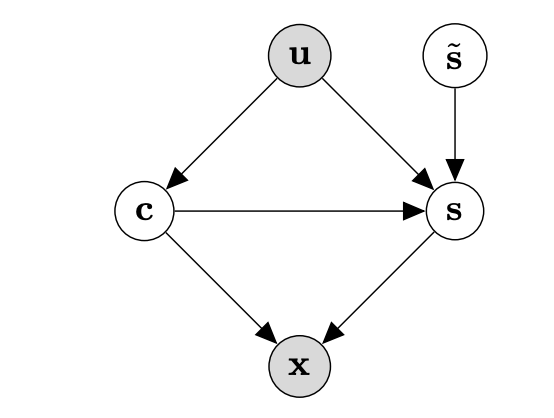

# Counterfactual Generation with Identifiability Guarantees
[Neurips23:Counterfactual Generation with Identifiability Guarantees](https://openreview.net/forum?id=cslnCXE9XA)

**Motivation**: Counterfactual generation lies at the core of various machine learning tasks. Existing disentangled methods crucially rely on oversimplified assumptions, such as assuming independent content and style variables, to identify the latent variables, even though such assumptions may not hold for complex data distributions. This problem is exacerbated when data are sampled from multiple domains since the dependence between content and style may vary significantly over domains. 

**Solutions:** In this work, we tackle the domain-varying dependence between the content and the style variables inherent in the counterfactual generation task. We provide identification guarantees for such latent-variable models by leveraging the relative sparsity of the influences from different latent variables. Our theoretical insights enable the development of a do**M**ain **A**dap**T**ive coun**T**erfactual g**E**neration model, called (MATTE). This is an unsupervised style-transfer framework, based on th [CPVAE framework](https://github.com/BorealisAI/CP-VAE).

<p align="center">

</p>
The data generation process: The grey shading indicates the variable is observed. x is text, c and s are content and style variables, the noise s is the exgenous variable, indepedent to c, u is the domain index.
<br>
</br>
<p align="center">

</p>

## Code Structure
```
bash scripts/train.sh  #train the model
bash scripts/transfer_all.sh #tranfer to target attribute based on the well-trained latent space
python evaluate_output.py #evaluate the generated text in BLEU, ACC, G-SCORE, PPL, and CTC score.
```

## Citation

If you find our work useful, please cite as:

```
@inproceedings{
yan2023counterfactual,
title={Counterfactual Generation with Identifiability Guarantees},
author={Hanqi Yan and Lingjing Kong and Lin Gui and Yuejie Chi and Eric Xing and Yulan He and Kun Zhang},
booktitle={Thirty-seventh Conference on Neural Information Processing Systems},
year={2023},
url={https://openreview.net/forum?id=cslnCXE9XA}
}
```
