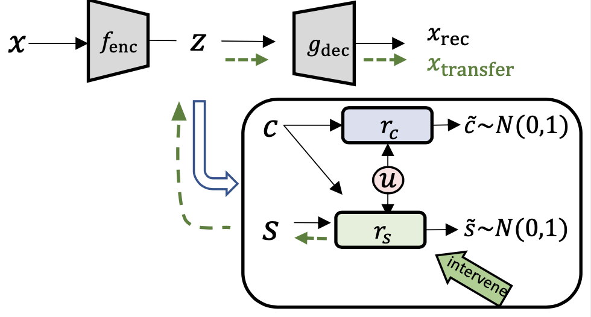

# Counterfactual Generation with Identifiability Guarantees
[Neurips23:Counterfactual Generation with Identifiability Guarantees](https://openreview.net/forum?id=cslnCXE9XA)

**Motivation**: Counterfactual generation lies at the core of various machine learning tasks. Existing disentangled methods crucially rely on oversimplified assumptions, such as assuming independent content and style variables, to identify the latent variables, even though such assumptions may not hold for complex data distributions. This problem is exacerbated when data are sampled from multiple domains since the dependence between content and style may vary significantly over domains. 
**Solutions:** In this work, we tackle the domain-varying dependence between the content and the style variables inherent in the counterfactual generation task. We provide identification guarantees for such latent-variable models by leveraging the relative sparsity of the influences from different latent variables. Our theoretical insights enable the development of a do**M**ain **A**dap**T**ive coun**T**erfactual g**E**neration model, called (MATTE). 

<p align="center">

</p>

<p align="center">

</p>

## Code Structure
```
bash scripts/train.sh  #train the model
bash scripts/transfer.sh #tranfer to target attribute based on the well-trained latent space
```

## Citation

If you find our work useful, please cite as:

```
@misc{yan2021position,
      title={Position Bias Mitigation: A Knowledge-Aware Graph Model for Emotion Cause Extraction}, 
      author={Hanqi Yan and Lin Gui and Gabriele Pergola and Yulan He},
      year={2021},
      eprint={2106.03518},
      archivePrefix={arXiv},
      primaryClass={cs.CL}
}
```
